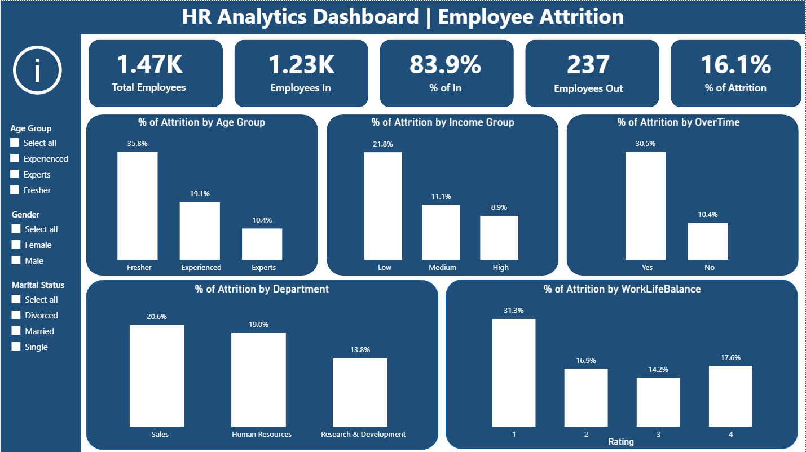

# 📊 HR Analytics Dashboard | Employee Attrition Analysis

## Project Overview

This project presents an interactive HR Analytics Dashboard developed in Power BI to analyze employee attrition patterns and identify the key factors contributing to workforce turnover.

The dashboard transforms raw HR data into actionable insights, enabling organizations to understand employee behavior, improve retention strategies, and support data-driven decision-making.

---

## Business Problem

Employee attrition is a critical challenge that impacts productivity, recruitment costs, employee morale, and organizational performance.

The objective of this project is to answer the following business question:

**Why are employees leaving the organization?**

By analyzing employee demographics, compensation, work-life balance, overtime, and job satisfaction metrics, the dashboard identifies the primary drivers of attrition.

---

## Project Objectives

* Analyze overall employee attrition trends
* Identify high-risk employee groups
* Evaluate the impact of overtime on attrition
* Assess the relationship between compensation and employee turnover
* Investigate the effect of work-life balance on retention
* Support HR teams with actionable workforce insights

---

## Dashboard Preview

---

## Key Performance Indicators (KPIs)

* Total Employees
* Employees Left
* Employees Stayed
* Attrition Rate (%)

---

## Key Findings

### 1. Freshers Exhibit Higher Attrition

Employees in the Fresher category experience the highest attrition rates, indicating retention challenges during the early stages of employment.

### 2. Sales Department Has the Highest Attrition

The Sales department records the highest attrition rate among all departments, highlighting potential department-specific retention issues.

### 3. Overtime Significantly Impacts Attrition

Employees working overtime are substantially more likely to leave the organization than employees who do not work overtime.

### 4. Low-Income Employees Show Higher Attrition

Attrition rates are highest among employees in the low-income category, suggesting compensation plays a role in employee retention.

### 5. Poor Work-Life Balance Increases Attrition

Employees reporting poor work-life balance exhibit significantly higher attrition rates compared to other groups.

---

## Dashboard Components

### Employee Demographics

* Age Group Analysis
* Employee Distribution

### Department Analysis

* Department-wise Attrition
* Workforce Distribution

### Employee Satisfaction Analysis

* Job Satisfaction
* Work-Life Balance

### Compensation Analysis

* Income Group Analysis
* Attrition by Salary Level

### Workforce Retention Analysis

* Overtime Impact
* Employee Tenure Analysis

---

## Tools & Technologies

* Power BI
* Power Query
* DAX
* Data Modeling
* Data Visualization

---

## DAX Concepts Applied

* CALCULATE()
* FILTER()
* COUNTROWS()
* DIVIDE()
* SWITCH()
* DISTINCTCOUNT()
* 
---

## Skills Demonstrated

### Data Analysis

* Exploratory Data Analysis (EDA)
* Workforce Analytics
* Business Insight Generation

### Power BI

* Dashboard Development
* KPI Design
* Interactive Reporting

### Data Modeling

* Data Relationships
* Calculated Columns
* DAX Measures

### Business Analytics

* Employee Retention Analysis
* Attrition Investigation
* HR Analytics

---

## Business Impact

The dashboard helps HR teams identify the key factors influencing employee turnover and supports the development of targeted retention strategies focused on:

* Employee Well-being
* Compensation Planning
* Workforce Engagement
* Overtime Management
* Employee Retention Programs

---

## Conclusion

The analysis reveals that employee attrition is primarily influenced by overtime workload, low compensation, poor work-life balance, early-career employment stages, and department-specific challenges. By addressing these factors, organizations can improve employee satisfaction and reduce turnover.

---

## Author

**Shaik Anas**

MBA (Business Analytics)
JNTU Kakinada School of Management Studies

🔗 GitHub: Anas036-BA
